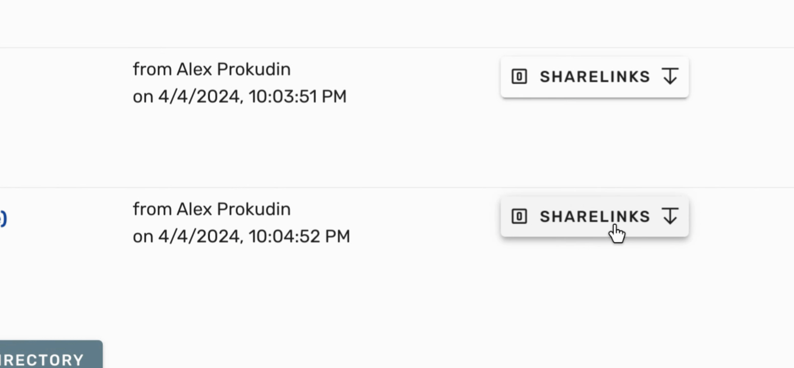
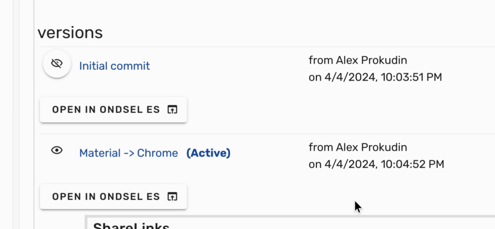
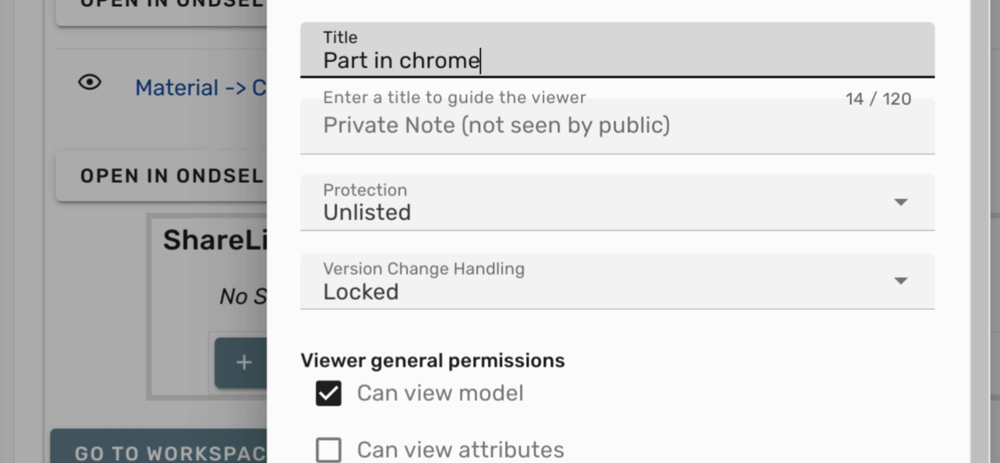
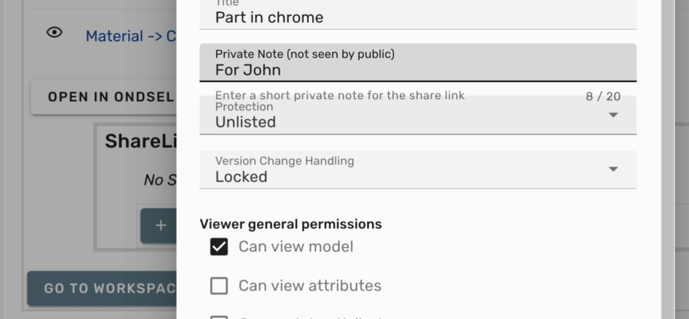
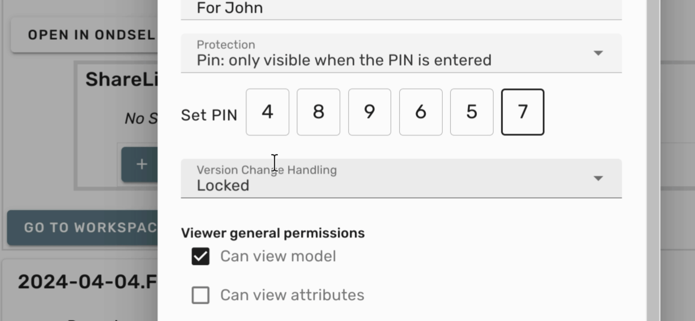
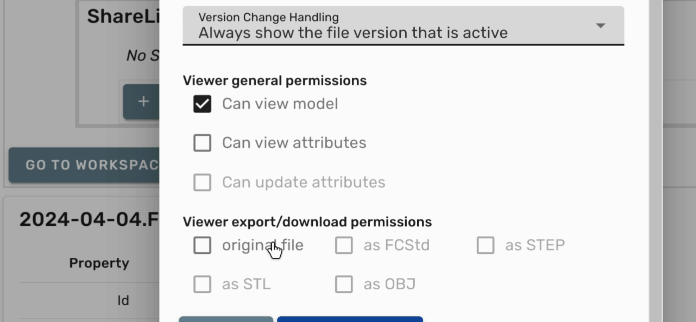
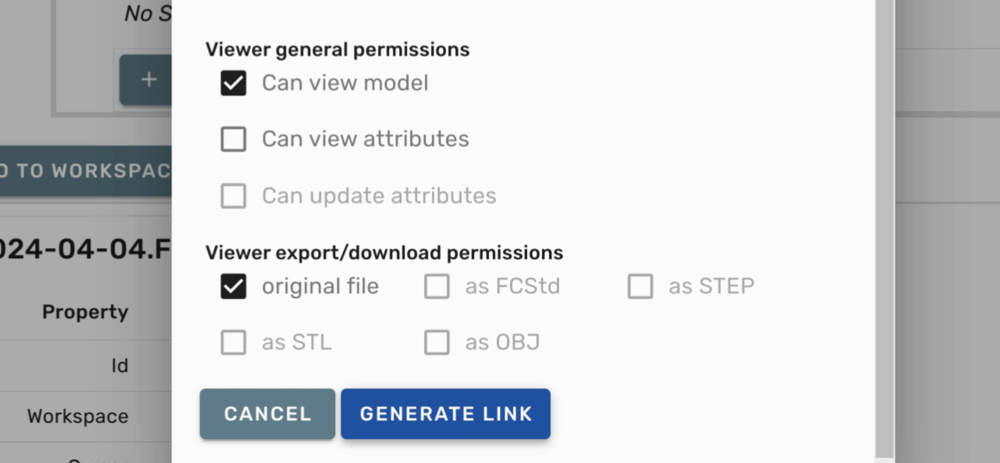
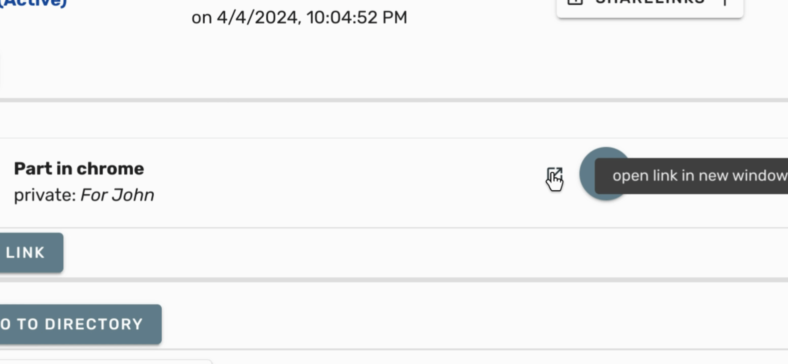

This tutorial will guide you through the process of creating a PIN-protected share link.

1. To begin, open the model page and scroll down to the list of versions.

---

2. Select a version and click on **Share Links**.

---

3. Next, click on **Create Link**.

---

4. Set a **Title** for the link.

---

5. Write a **private note** that is just for yourself.

---

6. Change the protection method to **PIN** and then set the PIN.

---

7. Select the **Version Change Handling method** as necessary.

---

8. If you want the recipient to have the ability to download the original file, be sure to check the **Original File** box.

---

9. Once you have completed the settings, click on **Generate Link**.

---

10. Finally, right-click on external link icon and choose **Copy Link Address** to copy your protected share link.

---

By following these steps, you will successfully create a PIN-protected share link.