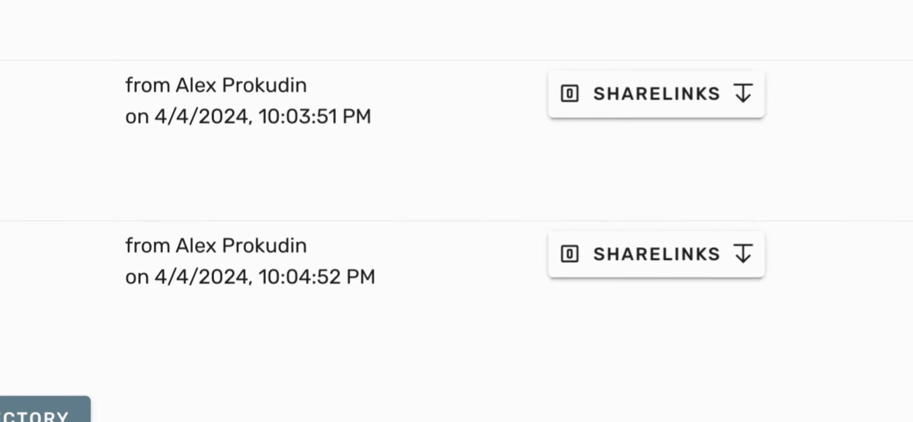
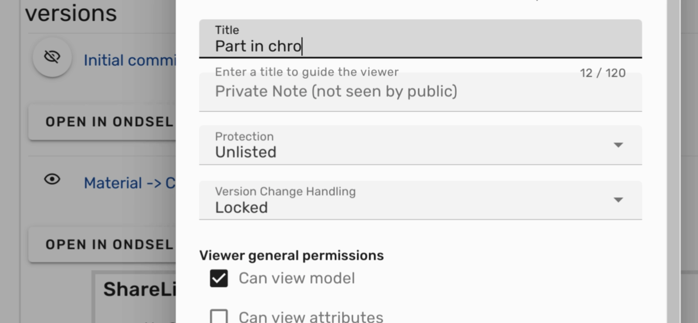
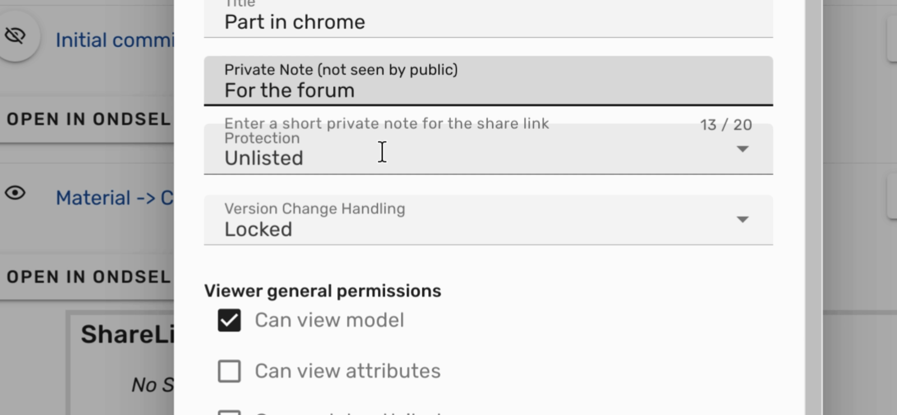
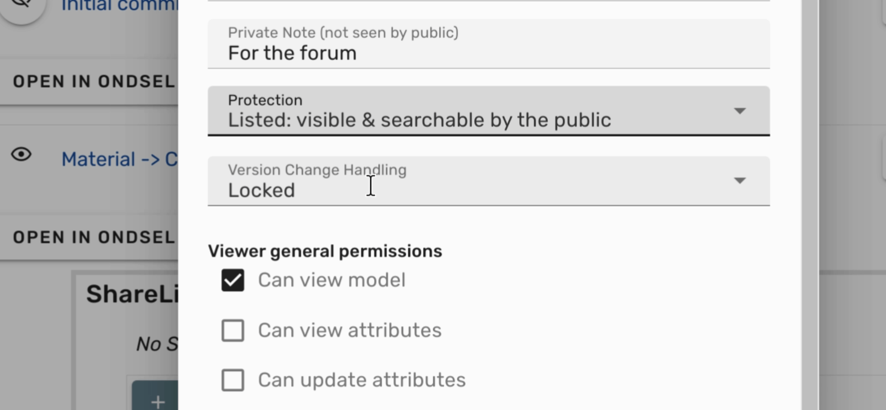
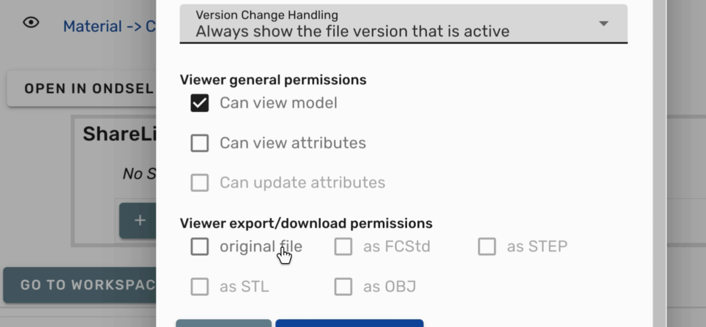
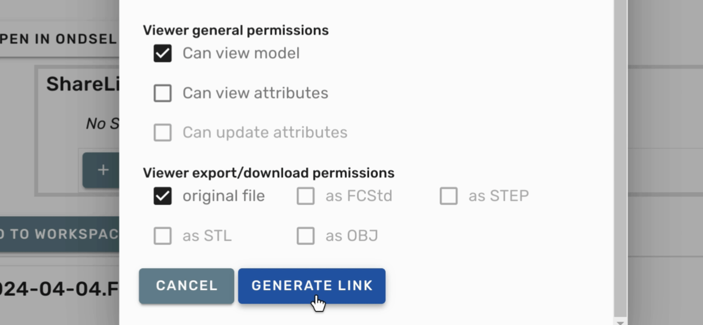
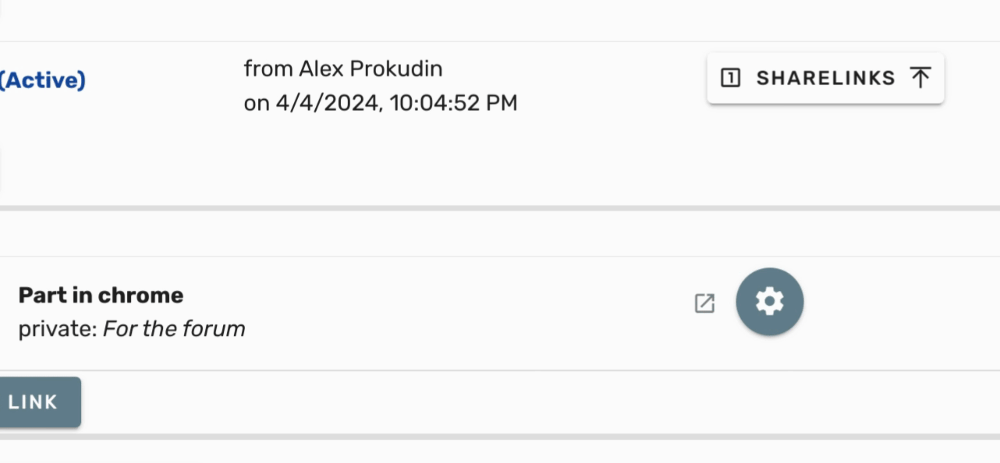

This tutorial will guide you through the process of creating a public share link for an active revision of your model.

1. To begin, open your model page and scroll down to the revision from which you want to create a share link.

---

2. Next, click the **ShareLinks** button, followed by **Create link**.

---

3. Set a suitable **Title** for the share link.

---

4. You also need to set a **Private note** that is just for your own reference.

---

5. Change the **Protection mode** to _Listed_.

---

6. Adjust the **Version change setting** to always show the file version that is active.

---

7. If you want to make the file downloadable, go to **View Export and Download Permissions**.

---

8. Then check the **Original file** box.

---

9. Finally, click on **Generate link** to produce your public share link.

---

10. You can now right-click and copy the link address for your public share link.

---

By following these steps, you will successfully create a public share link for your model revision.
