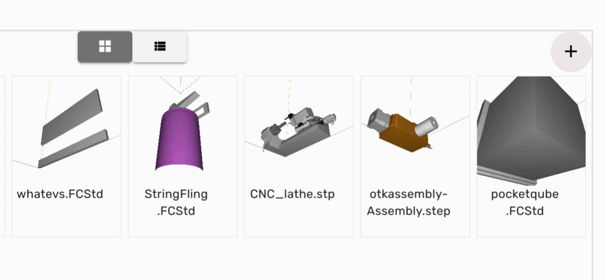

This tutorial will guide you through the process of uploading a file to your workspace.

1. Begin by clicking at the top of the sidebar to select the appropriate organization.

---

2. Then, select the desired workspace.

 

---

3. Next, click on the **+** icon and select **Add New File**.

 

---

4. Click on **Browse** to choose the file you wish to upload.

 

---

5. The selected file will then be added to the workspace and the designated folder.

---

6. You can double-click the file to open the model page.

 

---

7. To preview the uploaded model view, click on **Explore**.

 

---

By following these steps, you will successfully upload a file to your workspace and explore its content.